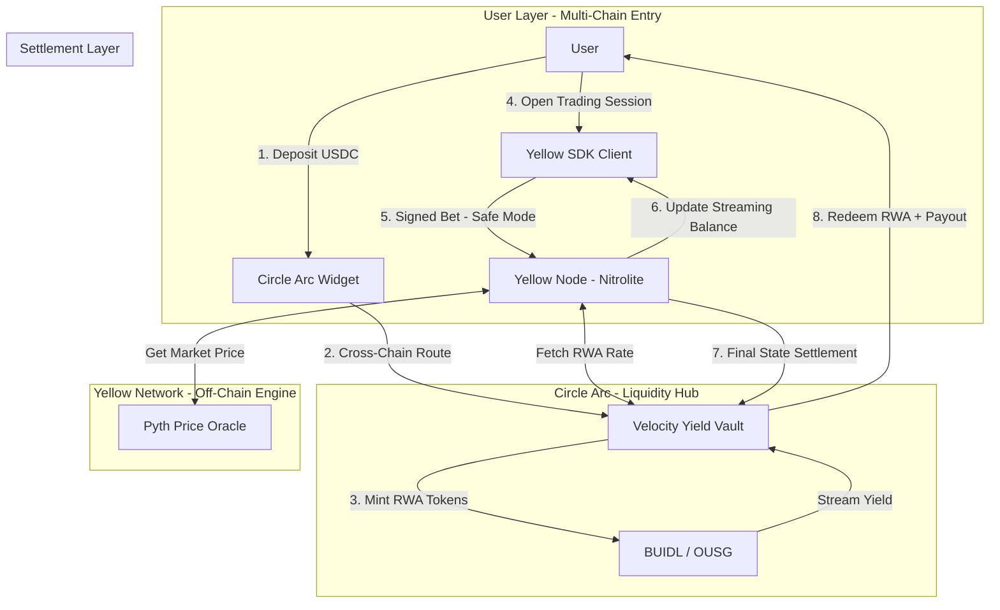

# Basis Zero: The Zero-Opportunity-Cost Prediction Market

**Submitting for Tracks:**
* 🚀 **Integrate Yellow SDK:** Trading apps/Prediction markets
* 🏆 **Best Chain Abstracted USDC Apps Using Arc as a Liquidity Hub**

---

## 1. Executive Summary
**Basis Zero** is a next-generation prediction market designed to eliminate the "hidden tax" of idle capital. In traditional markets, user collateral sits dormant. Basis Zero utilizes **Circle Arc** to bridge USDC into Yield-Bearing Real World Assets (RWAs) and the **Yellow Network** to stream that interest into a high-speed, off-chain trading session. Users can trade with their principal or engage in **"Safe Mode,"** where they only bet the yield generated by their assets, making the cost of participation effectively zero.

---

## 2. The Problem: The "Idle Capital" Tax
Current prediction markets (Polymarket, etc.) suffer from capital inefficiency:
1.  **Opportunity Cost:** Locking $5,000 in a 3-month political bet means losing ~5% APY available in T-Bills.
2.  **Fragmented Liquidity:** Funds are scattered across Base, Polygon, and Arbitrum, creating friction for entry.
3.  **High-Frequency Friction:** On-chain betting is too slow for real-time event trading and gas costs eat into small-margin gains.

---

## 3. The Solution: Basis Zero
Basis Zero flips the model by turning the prediction market into a **Streaming Yield Engine**.

### Core Pillars:
* **Yield as Collateral:** Deposits are instantly converted into tokenized T-Bills (via Circle Arc).
* **Streaming State Channels:** The **Yellow SDK** tracks balance *plus* accrued RWA interest in real-time, off-chain.
* **Risk-Free Speculation:** A "Safe Mode" that restricts betting power to the interest earned, protecting the user's initial principal.

---

## 4. Technical Architecture

### A. Circle Arc: The Global Liquidity Hub
We use Arc to solve the "entry" and "capital efficiency" problems:
* **Cross-Chain On-ramping:** Users deposit USDC from any supported EVM chain. Arc routes this into a unified "Velocity Yield Vault."
* **RWA Integration:** Arc acts as the routing layer to swap standard USDC for yield-bearing variants like **BlackRock BUIDL** or **OUSG**.
* **Chain Abstraction:** The user signs one intent; Arc handles the cross-chain movement to the most efficient yield source.

### B. Yellow Network & Nitrolite: The High-Speed Engine
The **Yellow SDK** moves the actual "betting" off-chain:
* **Streaming Balance Logic:** Unlike standard channels, our Nitrolite integration uses a time-delta function to calculate balance:
    $Balance_{current} = Balance_{initial} + (Principal \times RWA_{rate} \times \Delta t) - Bets_{placed}$
* **Session-Based Trading:** All micro-bets on sports or markets happen instantly with zero gas within a Nitrolite session.
* **On-Chain Settlement:** When the session ends, the final state—including principal and accrued interest—is settled on-chain via a single transaction.

---

## 5. Key Features & Innovation

| Feature | Description | Technical Edge |
| :--- | :--- | :--- |
| **Safe Mode** | Users bet only with their RWA yield. | Off-chain "Allowance" logic in Yellow SDK. |
| **Yielding Limit Orders** | Unfilled orders continue to earn interest. | Capital is never "locked" or idle in the state channel. |
| **Instant Settlement** | Wins are credited the moment the oracle reports. | Powered by Yellow’s Nitrolite protocol. |
| **Multi-Source Yield** | Arc scans for best RWA rates across chains. | Dynamic routing via Circle Arc. |

---

## 6. Business Model
1.  **Protocol Fee:** The protocol takes a small percentage (e.g., 10%) of the *yield generated*, rather than charging heavy trading fees.
2.  **Market Making:** LPs earn RWA yield *and* spread fees, solving the liquidity "chicken-and-egg" problem.
3.  **Institutional Access:** Bundles retail deposits into institutional RWAs that typically have high minimum buy-ins.

---

## 7. Implementation Roadmap (Hackathon Scope)
* **Phase 1:** Deploy a "Yield Vault" contract that simulates RWA interest accruing per block.
* **Phase 2:** Integrate **Circle Arc** to allow deposits from multiple testnets into the vault.
* **Phase 3:** Build the **Yellow SDK** provider to open sessions and handle off-chain bet signatures.
* **Phase 4:** Frontend Dashboard showing the "Live Ticking Balance" and "Safe Mode" toggle.

---

## 8. Conclusion
Basis Zero proves that **Yellow Network** can handle complex, time-dependent financial logic (streaming interest) and that **Circle Arc** can transform USDC into a dynamic, cross-chain yield generator. It solves the biggest pain point in DeFi: **The cost of waiting.**
