# Basis-Zero: Yield-Funded Prediction Market

Basis-Zero is a capital-efficient prediction market that eliminates the opportunity cost of betting. By integrating **Real-World Asset (RWA)** yields directly into the collateral vault, users can trade prediction markets using only the yield generated by their idle capital ("Safe Mode") or leverage their full principal for higher stakes ("Full Mode").

This project creates a seamless bridge between **DeFi Yield** (via RWA simulation) and **High-Frequency Trading** (via simulated Yellow Network state channels).

---

## 🚀 Core Features

### 1. The Yield Vault
- **Principal Protection**: Funds deposited into the `SessionEscrow` contract immediately start earning yield (simulating BlackRock BUIDL or similar RWA tokens).
- **Real-Time Accrual**: Yield is calculated second-by-second on-chain and visualized in real-time on the frontend.
- **Auto-Compounding**: Yield is tracked separately but can be utilized as margin.

### 2. Trading Modes
- **🛡️ Safe Mode (No-Loss Trading)**:
    - Users can only bet with their *accrued yield*.
    - The principal balance remains strictly locked and safe.
    - If a user loses a bet, it only reduces their yield balance.
- **⚡ Full Mode**:
    - Users can bet with both their *principal and yield*.
    - Allows for larger position sizing.
    - Losses first eat into yield, then into principal.

### 3. AMM Prediction Markets
- **Binary Markets**: YES/NO outcome shares.
- **Automated Market Maker**: Constant Product Market Maker (CPMM) logic running off-chain for instant execution.
- **Order Book UI**: Real-time price updates and trade execution.

---

## 🏗️ Architecture Overview

The system consists of three main components working in sync:

### 1. Smart Contracts (Polygon Amoy)
*   **`SessionEscrow.sol`**: The core on-chain component.
    *   **Custody**: Holds user USDC deposits.
    *   **Yield Engine**: Calculates linear yield based on a configurable BPS rate (e.g., 5200 bps = 52% APY).
    *   **Session Locking**: "Locks" funds when a user enters a trading session, preventing withdrawal during active trading.
    *   **Settlement**: Verifies backend signatures (Nitrolite) to settle trading PnL trustlessly.

### 2. Backend (Node.js / Express)
*   **Session Manager**: Orchestrates the "Open Session" and "Close Session" flows.
*   **Off-Chain AMM**: Manages the order book and matches trades locally during the active session. This simulates the high-speed performance of the Yellow Network.
*   **Signer Service**: Acts as the Yellow Network authority, signing final settlement payloads that the smart contract verifies.

### 3. Frontend (Next.js)
*   **Real-Time UI**: Uses `wagmi` and `viem` for blockchain interaction.
*   **Streaming Balances**: Visualizes yield growing in real-time.
*   **Dual-Mode Interface**: Toggles seamlessly between Safe Mode and Full Mode.

---

## 🟡 Yellow Network Integration (Architecture)

Basis-Zero leverages the **Yellow Network** architecture model for high-speed, gasless trading sessions that settle on-chain.

### The "Session" Model
Instead of executing every trade on-chain (slow, expensive), we use a **Session-based** approach:

1.  **Open Session (On-Chain)**:
    *   User calls `openSession(amount)` on `SessionEscrow`.
    *   Contract "locks" the specified amount (Principal + Yield).
    *   Contract emits `SessionOpened`.

2.  **Trade (Off-Chain / Yellow Network)**:
    *   The backend (simulating Yellow Nodes) detects the session.
    *   User signs orders off-chain (fast, 0 gas).
    *   The AMM updates the user's "Virtual Balance" instantly.
    *   Zero gas fees for individual trades.

3.  **Close & Settle (On-Chain)**:
    *   User requests to close the session.
    *   The backend calculates the final PnL (Profit/Loss).
    *   Backend (Nitrolite Signer) **signs** the final result.
    *   User (or Relayer) calls `settleSession(pnl, signature)` on-chain.
    *   Contract verifies the signature and updates the user's on-chain balance (Principal +/- PnL).

#### Session Sequence Diagram

```mermaid
sequenceDiagram
    participant User
    participant Frontend
    participant SessionEscrow as Contract
    participant Backend as Yellow Node

    User->>Frontend: Connect Wallet
    User->>Frontend: Deposit USDC
    Frontend->>SessionEscrow: deposit(amount)
    SessionEscrow-->>Frontend: Deposited

    rect rgb(20, 20, 20)
        Note right of User: Session Start
        User->>Frontend: Open Session
        Frontend->>SessionEscrow: openSession(amount)
        SessionEscrow-->>Backend: Event: SessionOpened
        Backend->>Backend: Initialize Session State
    end

    rect rgb(30, 30, 30)
        Note right of User: High Frequency Trading
        loop Trading Loop
            User->>Frontend: Place Bet (Safe/Full Mode)
            Frontend->>Backend: Sign Order (Off-chain)
            Backend->>Backend: Match Trade & Update PnL
            Backend-->>Frontend: Stream New Balance
        end
    end

    rect rgb(20, 20, 20)
        Note right of User: Settlement
        User->>Frontend: Close Session
        Frontend->>Backend: Request Settlement
        Backend->>Backend: Calculate Final PnL
        Backend-->>Frontend: Return {pnl, signature}
        Frontend->>SessionEscrow: settleSession(sessionId, pnl, sig)
        SessionEscrow->>SessionEscrow: Verify Sig & Update Balance
        SessionEscrow-->>Frontend: SessionSettled
    end
```


### System Data Flow

```
┌──────────────────────────────────────────────┐
│                Frontend (Web)                │
│                                              │
│ - Wallet connect                             │
│ - Deposit USDC                               │
│ - Open Yield-Only Session                    │
│ - Place instant bets                         │
│ - End session                                │
└───────────────▲──────────────────────────────┘
                │ wallet signatures
┌───────────────┴──────────────────────────────┐
│            Yellow SDK (Client Side)          │
│                                              │
│ - Creates Nitrolite session                  │
│ - Signs off-chain state updates              │
│ - Streams bet intents                        │
│ - Displays live yield + PnL                  │
└───────────────▲──────────────────────────────┘
                │ off-chain state transitions
┌───────────────┴──────────────────────────────┐
│         Yellow Network (Nitrolite)           │
│                                              │
│ Enforced Session State:                      │
│                                              │
│ principal_locked = deposit                   │
│ yield_accrued = P × r × Δt (contract)        │
│ pnl = realized bet results                   │
│ max_loss = yield_accrued                     │
│                                              │
│ RULES (hard enforced):                       │
│ - principal cannot be spent                  │
│ - pnl ≥ -yield_accrued                       │
│ - session freezes if violated                │
└───────────────▲──────────────────────────────┘
                │ oracle resolution
┌───────────────┴──────────────────────────────┐
│         Market Oracle (Mock / Simple)        │
│                                              │
│ - Resolves event outcome                     │
│ - Signs result                               │
└───────────────▲──────────────────────────────┘
                │ final state proof
┌───────────────┴──────────────────────────────┐
│     Settlement Contract (Polygon)            │
│                                              │
│ - Holds USDC                                 │
│ - Verifies final Yellow state                │
│ - Returns principal                          │
│ - Applies yield PnL                          │
│                                              │
│ ONLY TWO TXs:                                │
│ 1. Deposit                                   │
│ 2. Final Settlement                          │
└──────────────────────────────────────────────┘
```

### Security
*   **Signature Verification**: The `SessionEscrow` contract holds a list of `trustedNitroliteSigners`. Settlements are only accepted if signed by a trusted authority.
*   **Timeouts**: If the off-chain network goes down, users can trigger a `timeoutRelease` after 24 hours to recover their locked funds.

---

## 🛠️ Tech Stack

*   **Frontend**: Next.js 14, TailwindCSS, Shadcn/UI, Wagmi, Viem, Framer Motion.
*   **Backend**: Node.js, Express, Ethers.js.
*   **Blockchain**: Polygon Amoy Testnet.
*   **Contracts**: Solidity 0.8.24, OpenZeppelin.

## 🏁 Getting Started

### Prerequisites
*   Node.js v18+
*   Wallet with Polygon Amoy MATIC (for gas) and USDC (for testing).

### 1. Contracts
```bash
cd contracts
npm install
npx hardhat run scripts/deploy-session.ts --network amoy
```

### 2. Backend
```bash
cd backend
# Create .env from .env.example and add your Private Key (SIGNER_PRIVATE_KEY)
npm install
npm run dev
```

### 3. Frontend
```bash
cd frontend
# Create .env and add NEXT_PUBLIC_WALLET_CONNECT_PROJECT_ID
npm install
npm run dev
```

Visit `http://localhost:3000` to start trading!
