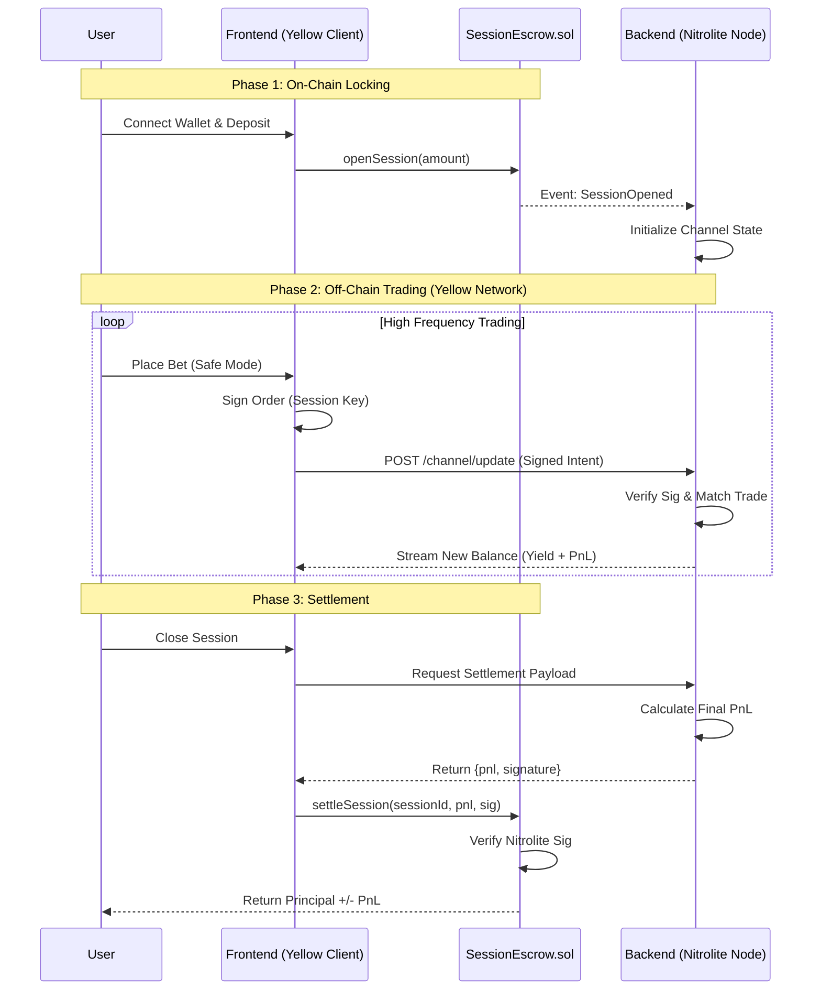

# ⚡ Basis-Zero: Yield-Funded Prediction Market
> **Trade the World, Keep Your Yield.**  
> *Built for the Yellow Network Hackathon Prize Track*

**Basis-Zero** is a capital-efficient prediction market that eliminates the opportunity cost of betting. By integrating **Real-World Asset (RWA)** yields directly into the collateral vault, users can trade prediction markets utilizing *only* the yield generated by their idle capital ("Safe Mode") or leverage their full principal ("Full Mode").

We bridge **DeFi Yield** (via RWA simulation) and **High-Frequency Trading** (via simulated Yellow Network state channels) to create a "No-Loss" gambling experience.

---

## 🏗️ Architecture Diagrams

### 1. System Components (Box Diagram)
High-level overview of how the Frontend, Backend (Yellow Node), and Blockchain interact.

```mermaid
graph TD
    subgraph "Client Layer"
        User[User / Bettor]
        FE[Frontend (Next.js)]
        YellowSDK[Yellow SDK (Nitrolite)]
    end

    subgraph "Off-Chain Layer (Private Hub)"
        BE[Backend Service (Node.js)]
        AMM[AMM Engine (CPMM)]
        Signer[Nitrolite Signer]
        DB[(Supabase / State Store)]
    end

    subgraph "On-Chain Layer (Polygon Amoy)"
        Contract[SessionEscrow.sol]
        USDC[USDC Token]
        Oracle[Market Oracle]
    end

    User -->|Interacts| FE
    FE -->|Embeds| YellowSDK
    YellowSDK -->|1. Sign Intent| BE
    
    BE -->|2. Execute Trade| AMM
    AMM -->|Update State| DB
    BE -->|3. Return Signed State| FE
    
    FE -->|4. Deposit / Settle| Contract
    Contract -->|Yield Logic| USDC
    Contract -->|Verify Settlement| Signer
    Contract -->|Resolve Market| Oracle
```

### 2. The "Session" Flow (Sequence Diagram)
Demonstrating the lifecycle of a user's funds from On-Chain Deposit to Off-Chain Trade to Final Settlement.



---

## 🚀 Core Features

### 1. The Yield Vault 🏦
- **Principal Protection**: Funds deposited immediately start earning yield (simulating RWA tokens).
- **Safe Mode**: Toggle this to bet *only* with accrued yield. Your principal is never touched.
- **Real-Time Visualization**: Watch your yield grow second-by-second while you trade.

### 2. Yellow Network Integration 🟡
- **State Channels**: We use the **Yellow SDK (`@erc7824/nitrolite`)** to sign state transitions off-chain.
- **Gasless Trading**: Once a session is open, every trade is a simple cryptographic signature. No gas, instant confirmation.
- **Trustless Settlement**: The backend acts as a specific "Nitrolite Node," providing a final cryptographic proof that the smart contract verifies before releasing funds.

### 3. Automated Market Maker (AMM) 📊
- **CPMM Logic**: Constant Product (`x * y = k`) implementation for automated liquidity.
- **Binary Outcome**: YES/NO shares are minted and burned instantly.

---

## 🛠️ Tech Stack

| Component | Technology |
|-----------|------------|
| **Frontend** | Next.js 14, TailwindCSS, Shadcn/UI, Framer Motion |
| **Yellow SDK** | `@erc7824/nitrolite`, `viem` (Session Keys) |
| **Backend** | Node.js, Express, Supabase (State Store) |
| **Smart Contract** | Solidity 0.8.24, Foundry/Hardhat |
| **Chain** | Polygon Amoy Testnet |

---

## 🏁 Getting Started

### Prerequisites
- Node.js v18+ (Recommended v20 or v22)
- Git

### 1. Smart Contracts
Deploy the `SessionEscrow` logic to Polygon Amoy.

```bash
cd contracts
npm install
# Deploy using Hardhat
npx hardhat run scripts/deploy-session.ts --network amoy
```

### 2. Backend (The Hub)
Runs the off-chain AMM and Nitrolite Signer.

```bash
cd backend
npm install
cp .env.example .env
# Add your Private Key (SIGNER_PRIVATE_KEY) to .env

# ⚠️ PRO TIP: Use this command for stable execution
npx tsx src/index.ts
```

### 3. Frontend ( The Interface)
Launches the Next.js application.

```bash
cd frontend
npm install
cp .env.example .env
# Add NEXT_PUBLIC_WALLET_CONNECT_PROJECT_ID

npm run dev
```

Open `http://localhost:3000` and start trading!

---

## 🏆 Hackathon Tracks
**Yellow Network**:
- **SDK Integration**: Utilizes `SessionKeyStateSigner` for client-side signing.
- **Architecture**: Implements the "Hub-and-Spoke" state channel model.
